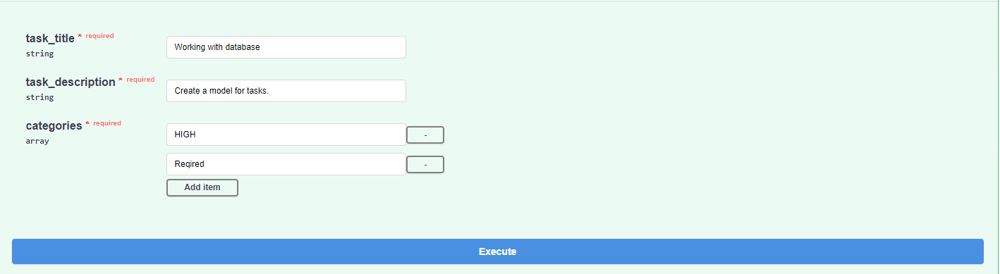

# Test task
This task is a simple RESTful web-service for working with TODO List.
You can do:
- Create a new task with categories;
- Get all tasks (with ordering and filtering);
- Get a task by id;
- Update a task;
- Delete a task.

## Instalation
To install you can run **docker-compose.yaml** file like `docker-compose up [-d]`
or install requirements from **requirements.txt** and run `uvicorn main:app`.

## Working process

For working with this service you can use [**Postman**](https://www.postman.com/downloads/) or 
if you have Internet connection, you can run the built-in Swagger from the link http://localhost:8000/docs.
The work will be shown using Swagger.

### Create a new task with categories 
After opening the first request, you need to fill in 3 required fields.
If you want you can add more categories.

### Get all tasks (with ordering and filtering)
In this request, all arguments are optional. 
If nothing is entered, all data will be displayed, otherwise with sorting and/or filtering.

### Get a task by id
In this request you must write the task in pk-field.

### Update a task
In this request you also must write the task in pk-field. 
You can change a task title and/or task description.

### Delete a task
In this request you must write only pk-field.

